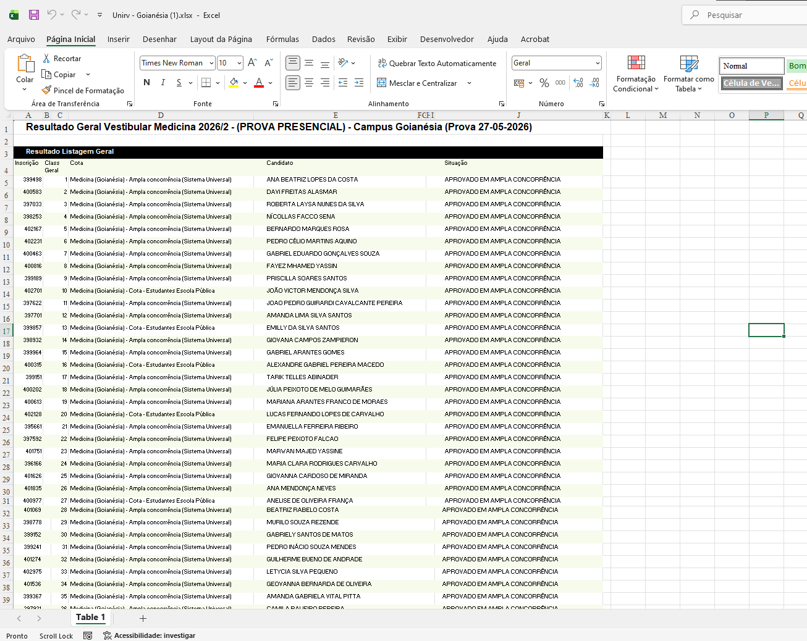
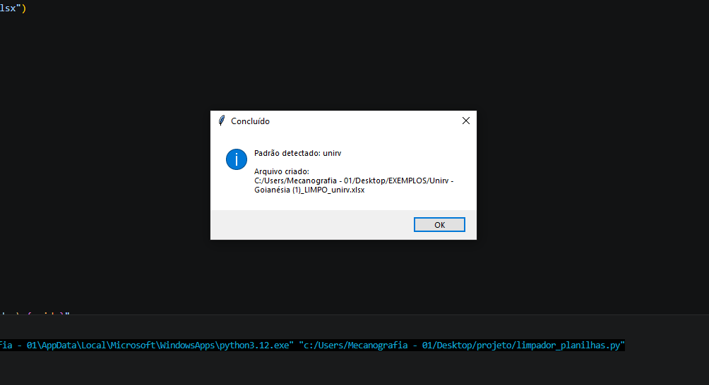
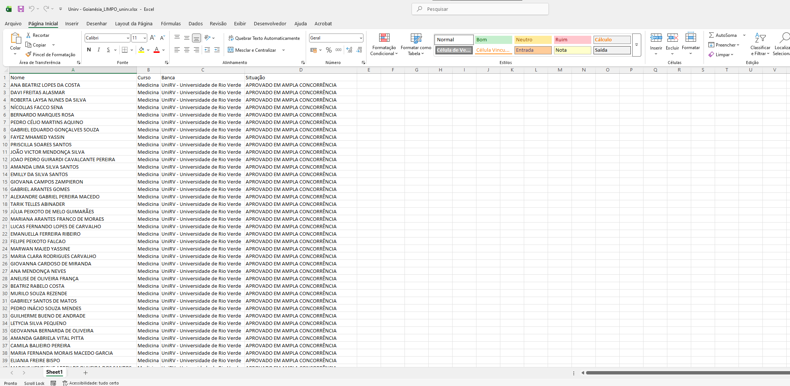
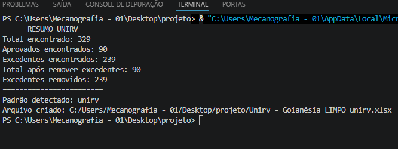

# ETL de Admissões Universitárias

<h2>📌 Sobre o projeto</h2>

Este projeto surgiu a partir de uma necessidade real observada durante minhas atividades profissionais: a padronização de listas de aprovados provenientes de diferentes instituições de ensino.

Cada planilha possuía estruturas, nomenclaturas e regras próprias, tornando o processo manual repetitivo e suscetível a erros. Para automatizar essa tarefa, desenvolvi uma aplicação em Python capaz de identificar automaticamente o modelo da instituição, extrair as informações relevantes, realizar a limpeza dos dados e gerar uma nova planilha padronizada.

O objetivo é tornar o processo mais rápido, confiável e escalável, facilitando a manipulação e organização de listas de admissões universitárias.

---

## Tecnologias utilizadas

- Python 3
- Pandas
- OpenPyXL
- Regex (Expressões Regulares)
- Tkinter

---

## Como funciona

O usuário seleciona uma planilha `.xlsx`.

O sistema:

1. Detecta automaticamente a instituição.
2. Extrai os dados relevantes.
3. Padroniza colunas 
4. Remove informações desnecessárias.
5. Mantém apenas os aprovados.
6. Gera uma nova planilha organizada.

---
# 📷 Exemplo 1 - Planilha original

---

# 📷 Exemplo 2 - Execução do programa

O usuário seleciona a planilha `.xlsx`, o sistema detecta automaticamente o modelo e gera um novo arquivo limpo.

---

# 📷 Exemplo 3 - Resultado gerado

A planilha é exportada contendo apenas os campos relevantes.

---

# 📷 Exemplo 4 - Resumo do processamento

O terminal informa:

- Total encontrado
- Quantidade de aprovados
- Quantidade de excedentes
- Quantidade removida

---

## Possíveis melhorias

- Exportação para CSV
- Interface gráfica mais completa
- Suporte a novas universidades
- Leitura de PDFs
- Geração de relatórios automáticos

---

## 👩‍💻 Autora

**Flávia Rosa**

Graduada em Análise e Desenvolvimento de Sistemas  
Pós-graduação em Data Science e Inteligência Artificial  

GitHub: @Rflavia
